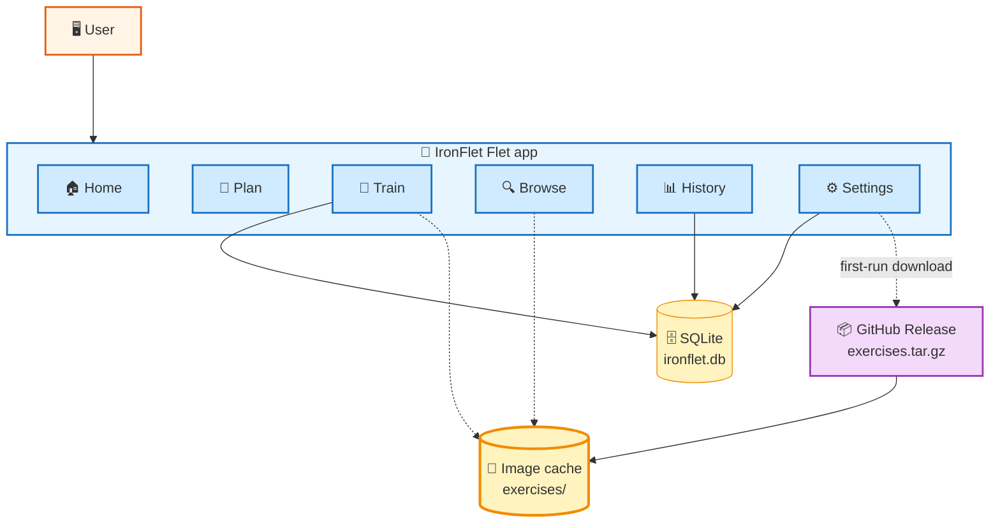

# IronFlet — Bilingual Weight Training Tracker

<div align="center">

[](README.md)
[](README.es.md)


**Offline-first fitness tracker with 7 periodized routines, 68 annotated exercises and animated technique images. One Python codebase runs as an Android APK, a native desktop window, or a local web app.**

</div>

---

## Table of Contents

| # | Section | # | Section |
|:-:|---------|:-:|---------|
| 1 | [Introduction](#-introduction) | 8 | [Build Android (APK)](#-build-android-apk) |
| 2 | [Architecture](#-architecture) | 9 | [Routines & Exercises](#-routines--exercises) |
| 3 | [Quick Start](#-quick-start) | 10 | [Localization](#-localization) |
| 4 | [Features](#-features) | 11 | [Backup & Restore](#-backup--restore) |
| 5 | [Installation](#-installation) | 12 | [Development](#-development) |
| 6 | [Project Structure](#-project-structure) | 13 | [Roadmap](#-roadmap) |
| 7 | [Configuration](#-configuration) | 14 | [License & Credits](#-license--credits) |

---

## Introduction

**IronFlet** is an offline-first fitness app for weight-training with periodized
routines. It tracks sets, reps, rest, body weight and personal health
metrics, and works without an account, without servers and without
telemetry.

### Key Features

| | Feature | Detail |
|:-:|---------|--------|
| **📅** | **7 periodized routines** | CambiaTuFísico (7 phases / 24 weeks), Upper/Lower, Push/Pull/Legs, plus 4 women-focused routines. |
| **💪** | **68 exercises with images** | Two frames cross-fade every 700 ms for animated technique reference. |
| **📝** | **Step-by-step instructions** | Written in Spanish and English for every exercise. |
| **⏱️** | **Session chronometer** | Elapsed time while training plus total duration on finish. |
| **↔️** | **Swipe between exercises** | Horizontal drag to jump to next / previous during a session. |
| **📊** | **Health metrics** | BMI, BMR (Mifflin-St Jeor), TDEE, protein and water targets. |
| **⚖️** | **Weight log** | Timeline chart of body weight plus per-entry delete. |
| **💾** | **JSON backup** | Export / import through the system clipboard. |
| **🌐** | **Bilingual UI** | ES / EN with a persistent language toggle. |

---

## Architecture



Everything lives in the app process: Flet renders the UI on Flutter, the
Python side owns the state, SQLite persists it, and the exercise image
cache is pulled on demand from this repository's own GitHub Release so
the APK itself stays small.

---

## Quick Start

```bash
# Install deps and dev tooling
uv sync --group dev

# Native desktop window (default)
uv run python main.py

# Web (localhost:8550, reachable on the LAN)
IRONFLET_WEB=1 uv run python main.py

# Android APK (~80 MB, arm64 only)
flet build apk --target-platform android-arm64
adb install -r build/apk/app-release.apk
```

> [!NOTE]
> First time you open the exercises screen, tap *Settings → Data →
> Exercise guides → Download* (~9 MB) to fetch photos and step-by-step
> instructions. Without that bundle the app still works; exercises fall
> back to a placeholder icon.

---

## Features

### Training

- 7 periodized routines selectable in the Plan tab; switching routine
  persists across launches.
- Guided flow: routine → phase → day → exercise; track sets, reps and
  rest seamlessly.
- Horizontal swipe jumps between exercises during a session.
- Per-session chronometer with the final duration shown on the finish
  screen.
- Rest timer with presets (1', 1:30, 2', 3') and audible countdown.

### Exercise library

- 68 exercises with two-frame animated images, equipment, level, and
  primary / secondary muscle groups.
- Step-by-step instructions written in Spanish and English.
- Searchable browser filtered by muscle group.

### User & health

- Profile: name, birthdate, height, sex, activity level.
- Derived metrics: age, BMI + category, BMR (Mifflin-St Jeor),
  TDEE, protein range (1.6–2.2 g/kg), water target (~35 ml/kg).
- Weight log with trend chart and per-entry delete.
- History of every exercise: PR, max weight, and total volume over time.

### Data

- SQLite (stdlib only), single file `ironflet.db`.
- JSON backup / restore through the clipboard.
- Destructive actions (clear history, clear all data) behind a confirm.

---

## Installation

### Android

Download the APK attached to the latest
[release](https://github.com/kalexnolasco/ironflet/releases/latest),
transfer it to your phone and install it (enable *Install from unknown
sources* for your file manager if needed).

### Desktop (Linux)

```bash
sudo apt install libmpv2    # Flet desktop runtime needs libmpv
sudo ln -sf libmpv.so.2 /usr/lib/x86_64-linux-gnu/libmpv.so.1
uv sync --group dev
uv run python main.py
```

### Web

```bash
IRONFLET_WEB=1 uv run python main.py
# then open http://localhost:8550 in any browser
```

---

## Project Structure

```
ironflet/
├── main.py                    # entry point + navigation + lifecycle
├── storage.py                 # SQLite layer (workouts, profile, weights, prefs)
├── data.py                    # routines, phases, days, exercise catalog
├── health.py                  # BMI / BMR / TDEE / protein / water
├── i18n.py                    # translations and helpers
├── guides.py                  # in-app training / nutrition / women tips
├── exercise_images.py         # canonical name -> Free Exercise DB slug
├── exercise_details.py        # auto-generated details (EN)
├── exercise_details_es.py     # hand-written ES instructions
├── asset_manager.py           # runtime download of image tarball
├── theme.py                   # palette, reusable widgets
├── components/
│   ├── timer.py               # rest timer with async tick
│   └── charts.py              # bar chart primitive
├── views/
│   ├── home.py
│   ├── plan.py
│   ├── workout.py
│   ├── browse.py
│   ├── history.py
│   ├── profile.py
│   ├── exercise_dialog.py
│   └── guide_dialog.py
├── tests/
│   ├── test_health.py
│   └── test_smoke.py
├── .github/
│   ├── workflows/
│   │   ├── ci.yml             # lint + format + tests
│   │   └── release.yml        # APK build on tag push
│   ├── ISSUE_TEMPLATE/
│   └── dependabot.yml
├── pyproject.toml
├── CHANGELOG.md
├── CONTRIBUTING.md
├── LICENSE
└── VERSION
```

---

## Configuration

**Path:** `pyproject.toml`

| Section | Purpose |
|---------|---------|
| `[project]` | Metadata, dependencies, Python version. |
| `[dependency-groups.dev]` | ruff, pytest, pre-commit. |
| `[tool.flet]` | App entry point module. |
| `[tool.flet.splash]` | Splash color (dark to avoid white flash). |
| `[tool.flet.android]` | Package name, product name, icon, splash. |
| `[tool.ruff]` | Line length 100, py310 target. |
| `[tool.pytest.ini_options]` | Tests live in `tests/`, asyncio auto. |

> [!IMPORTANT]
> When bumping the app version edit **both** the `version` field in
> `pyproject.toml` and the `VERSION` file, then update `CHANGELOG.md`.

---

## Build Android (APK)

The first build downloads Flutter 3.27+ and JDK 17 automatically through
Flet's `serious-python` toolchain.

```bash
# Universal APK (all 3 archs, ~166 MB)
flet build apk

# arm64-only APK (~80 MB, fits >99% of modern phones)
flet build apk --target-platform android-arm64

# Install on a connected device
adb install -r build/apk/app-release.apk
```

The CI workflow `.github/workflows/release.yml` builds and attaches the
APK to any Git tag that matches `v*` (so pushing `v0.2.0` produces an
APK on that release automatically).

> [!WARNING]
> Building the APK requires ~4 GB of free disk space for the Flutter
> cache and takes 10–15 min the first time; subsequent builds are ~3 min.

---

## Routines & Exercises

### Built-in routines

| Routine | Days | Duration | Focus |
|---------|-----:|---------:|-------|
| **CambiaTuFísico** | variable | 24 weeks / 7 phases | Full periodization |
| **Upper / Lower** | 4 | 12 weeks / 2 phases | Balanced strength & size |
| **Push / Pull / Legs** | 6 | 12 weeks / 2 phases | High frequency split |
| **Women Fitness** | 3–4 | 12 weeks / 2 phases | Glute + toning |
| **Women — Home** | 3 | 8 weeks / 1 phase | Bodyweight + optional DBs |
| **Women — Strength** | 4 | 12 weeks / 2 phases | Heavy barbell compounds |
| **Women — Volume** | 4 | 12 weeks / 2 phases | Hypertrophy high-volume |

### Exercise data

Exercise images and reference instructions come from the
[Free Exercise DB](https://github.com/yuhonas/free-exercise-db)
(Unlicense / public domain). The app ships with mappings for 68 exercises
covering chest, back, shoulders, biceps, triceps, legs, abs and cardio.

At runtime `asset_manager.py` downloads
`exercises.tar.gz` from this repository's own release (stable URL derived
from the `RELEASE_VERSION` constant) and extracts it into the platform's
app-storage directory.

---

## Localization

The UI is available in Spanish (`es`) and English (`en`) with a
persistent toggle in the Home header.

- `i18n.t(text)` — flat string translation (code uses English literals).
- `i18n.t_muscle(name)` — muscle-group names (disambiguates *Back* the
  button from *Back* the muscle).
- `i18n.t_exercise(s)` — exercise names preserving trailing `[schemes]`
  and `*` markers; in-bracket tokens also translated (`max`↔`máx`,
  `failure`↔`fallo`).
- `i18n.day_name(i)`, `i18n.month_name(i)` — calendar labels.

The user's language is stored in the `prefs` table of SQLite and reloaded
at startup.

---

## Backup & Restore

Accessible from *Settings → Data → Backup*.

- **Export** produces a summary dialog with total workouts, weight
  entries, prefs and profile. A single button copies the full JSON to
  the clipboard.
- **Import** accepts JSON pasted from the clipboard. The app validates
  the payload shape and version, then wipes all tables and re-inserts
  the data.
- **Clear workout history** removes only the `workouts` table (profile
  and weights stay).
- **Clear all data** wipes every table. Confirmation required.

---

## Development

```bash
uv sync --group dev                      # env + dev tooling
uv run pre-commit install                # auto-lint on commit

uv run ruff check .                      # lint
uv run ruff format .                     # format
uv run pytest -q                         # run tests
uv run pytest tests/test_health.py -v    # single file
```

See [CONTRIBUTING.md](CONTRIBUTING.md) for the full flow, style rules,
and instructions for adding a new routine or exercise.

---

## Roadmap

- [ ] Google OAuth + Drive sync (automatic backup)
- [ ] Real screenshots in the README (currently text only)
- [ ] Custom adaptive icon (today uses the Flet default)
- [ ] Extra bodyweight-only routines
- [ ] CSV export of workout history

---

## License & Credits

- **Source code**: [MIT License](LICENSE).
- **Exercise images and instruction source**:
  [Free Exercise DB](https://github.com/yuhonas/free-exercise-db) —
  Unlicense / public domain. Not redistributed with the source tree;
  downloaded at runtime from a repository release.
- **Routine category structure** inspired by the publicly visible
  classification on [cambiatufisico.com](https://www.cambiatufisico.com).
  Every routine is modeled as data (sets × reps + exercises); all
  explanatory text, in-app tips and Spanish instructions are original.

---

<div align="center">

**IronFlet** · Flet · Python

[Language Selection](README.md) · [Documentacion en Espanol](README.es.md)

&copy; 2026 Alex Nolasco

</div>
