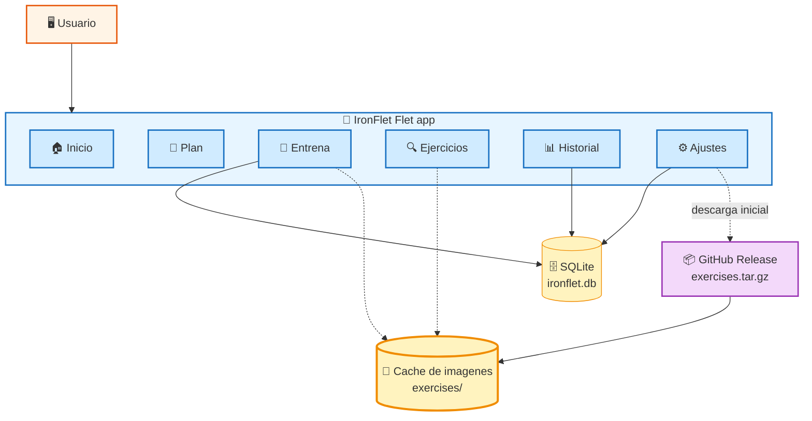

# IronFlet — Registro de Entrenamiento Bilingüe

<div align="center">

[](README.md)
[](README.en.md)


**Tracker de entrenamiento offline con 7 rutinas periodizadas, 68 ejercicios con imágenes animadas e instrucciones paso a paso. Un único código Python que corre como APK Android, ventana nativa de escritorio o aplicación web local.**

</div>

---

## Tabla de Contenidos

| # | Seccion | # | Seccion |
|:-:|---------|:-:|---------|
| 1 | [Introduccion](#-introduccion) | 8 | [Build Android (APK)](#-build-android-apk) |
| 2 | [Arquitectura](#-arquitectura) | 9 | [Rutinas y Ejercicios](#-rutinas-y-ejercicios) |
| 3 | [Inicio Rapido](#-inicio-rapido) | 10 | [Localizacion](#-localizacion) |
| 4 | [Caracteristicas](#-caracteristicas) | 11 | [Copia de Seguridad](#-copia-de-seguridad) |
| 5 | [Instalacion](#-instalacion) | 12 | [Desarrollo](#-desarrollo) |
| 6 | [Estructura del Proyecto](#-estructura-del-proyecto) | 13 | [Roadmap](#-roadmap) |
| 7 | [Configuracion](#-configuracion) | 14 | [Licencia y Creditos](#-licencia-y-creditos) |

---

## Introduccion

**IronFlet** es una app offline para registrar entrenamientos de pesas con
rutinas periodizadas. Anota series, repeticiones, descanso, peso corporal
y métricas de salud sin cuenta, sin servidores y sin telemetría.

### Caracteristicas Clave

| | Caracteristica | Detalle |
|:-:|----------------|---------|
| **📅** | **7 rutinas periodizadas** | CambiaTuFísico (7 fases / 24 sem), Upper/Lower, Push/Pull/Legs y 4 variantes femeninas. |
| **💪** | **68 ejercicios con imagen** | Dos frames que alternan cada 700 ms para ver la ejecución en bucle. |
| **📝** | **Instrucciones paso a paso** | Escritas en español y en inglés para cada ejercicio. |
| **⏱️** | **Cronómetro de sesión** | Tiempo transcurrido durante el entrenamiento y duración final al terminar. |
| **↔️** | **Swipe entre ejercicios** | Deslizamiento horizontal para saltar al siguiente o anterior. |
| **📊** | **Métricas de salud** | IMC, TMB (Mifflin-St Jeor), GEDT, proteína y agua objetivo. |
| **⚖️** | **Registro de peso** | Gráfico histórico y borrado entrada a entrada. |
| **💾** | **Backup en JSON** | Exportar / importar vía portapapeles del sistema. |
| **🌐** | **Interfaz bilingüe** | ES / EN con toggle persistente. |

---

## Arquitectura



Todo corre dentro del proceso de la app: Flet renderiza el UI sobre
Flutter, la parte Python lleva el estado, SQLite lo persiste y el cache
de imágenes de ejercicios se descarga bajo demanda desde la propia
release del repositorio para que la APK pese menos.

---

## Inicio Rapido

```bash
# Instala dependencias + tooling de desarrollo
uv sync --group dev

# Ventana nativa de escritorio (por defecto)
uv run python main.py

# Modo web (localhost:8550, accesible en la LAN)
IRONFLET_WEB=1 uv run python main.py

# APK Android (~80 MB, solo arm64)
flet build apk --target-platform android-arm64
adb install -r build/apk/app-release.apk
```

> [!NOTE]
> La primera vez que abras los ejercicios ve a *Ajustes → Datos → Guías
> de ejercicios → Descargar* (~9 MB) para traer las fotos e
> instrucciones. Sin ese bundle la app funciona, pero los ejercicios
> muestran un icono de pesa placeholder.

---

## Caracteristicas

### Entrenamiento

- 7 rutinas periodizadas seleccionables en la pestaña Plan; el cambio
  persiste entre arranques.
- Flujo guiado: rutina → fase → día → ejercicio; registra series, reps
  y descanso sin fricción.
- Swipe horizontal para saltar entre ejercicios durante la sesión.
- Cronómetro de sesión con la duración total mostrada al terminar.
- Temporizador de descanso con presets (1', 1:30, 2', 3') y cuenta
  atrás audible.

### Librería de ejercicios

- 68 ejercicios con imagen animada de dos frames, equipamiento, nivel
  y músculos primario / secundario.
- Instrucciones paso a paso en español e inglés.
- Navegador filtrable por grupo muscular.

### Usuario y salud

- Perfil: nombre, fecha de nacimiento, altura, sexo, nivel de actividad.
- Métricas derivadas: edad, IMC + categoría, TMB (Mifflin-St Jeor),
  GEDT, rango de proteína (1.6–2.2 g/kg), hidratación (~35 ml/kg).
- Registro de peso con gráfico de tendencia y borrado por entrada.
- Historial por ejercicio: PR, peso máximo y volumen total por fecha.

### Datos

- SQLite (solo stdlib), un único fichero `ironflet.db`.
- Backup / restore en JSON vía portapapeles.
- Acciones destructivas (borrar historial, borrar todo) con
  confirmación.

---

## Instalacion

### Android

Descarga la APK de la última
[release](https://github.com/kalexnolasco/ironflet/releases/latest),
pásala a tu móvil e instálala (activa *Permitir de orígenes desconocidos*
para el gestor de archivos que uses si hace falta).

### Escritorio (Linux)

```bash
sudo apt install libmpv2    # el runtime Flet desktop lo necesita
sudo ln -sf libmpv.so.2 /usr/lib/x86_64-linux-gnu/libmpv.so.1
uv sync --group dev
uv run python main.py
```

### Web

```bash
IRONFLET_WEB=1 uv run python main.py
# abre http://localhost:8550 en cualquier navegador
```

---

## Estructura del Proyecto

```
ironflet/
├── main.py                    # entrypoint + navegacion + lifecycle
├── storage.py                 # capa SQLite (workouts, profile, pesos, prefs)
├── data.py                    # rutinas, fases, dias, catalogo de ejercicios
├── health.py                  # IMC / TMB / GEDT / proteina / agua
├── i18n.py                    # traducciones y helpers
├── guides.py                  # tips in-app (entreno / nutricion / mujer)
├── exercise_images.py         # nombre canonico -> slug Free Exercise DB
├── exercise_details.py        # detalles auto-generados (EN)
├── exercise_details_es.py     # instrucciones en espanol, escritas a mano
├── asset_manager.py           # descargador runtime del tarball de imagenes
├── theme.py                   # paleta y widgets reutilizables
├── components/
│   ├── timer.py               # temporizador de descanso con tick async
│   └── charts.py              # primitiva de grafico de barras
├── views/
│   ├── home.py
│   ├── plan.py
│   ├── workout.py
│   ├── browse.py
│   ├── history.py
│   ├── profile.py
│   ├── exercise_dialog.py
│   └── guide_dialog.py
├── tests/
│   ├── test_health.py
│   └── test_smoke.py
├── .github/
│   ├── workflows/
│   │   ├── ci.yml             # lint + format + tests
│   │   └── release.yml        # build APK al pushear un tag
│   ├── ISSUE_TEMPLATE/
│   └── dependabot.yml
├── pyproject.toml
├── CHANGELOG.md
├── CONTRIBUTING.md
├── LICENSE
└── VERSION
```

---

## Configuracion

**Ruta:** `pyproject.toml`

| Seccion | Proposito |
|---------|-----------|
| `[project]` | Metadatos, dependencias, version de Python. |
| `[dependency-groups.dev]` | ruff, pytest, pre-commit. |
| `[tool.flet]` | Modulo de entrada de la app. |
| `[tool.flet.splash]` | Color del splash (oscuro para evitar flash blanco). |
| `[tool.flet.android]` | Package name, product name, icono, splash. |
| `[tool.ruff]` | Linea 100, target py310. |
| `[tool.pytest.ini_options]` | Tests en `tests/`, asyncio auto. |

> [!IMPORTANT]
> Al subir la versión de la app edita **a la vez** el campo `version` de
> `pyproject.toml` y el fichero `VERSION`, y actualiza `CHANGELOG.md`.

---

## Build Android (APK)

La primera build descarga Flutter 3.27+ y JDK 17 automáticamente a
través del toolchain `serious-python` de Flet.

```bash
# APK universal (3 arquitecturas, ~166 MB)
flet build apk

# APK solo arm64 (~80 MB, cubre >99% de móviles actuales)
flet build apk --target-platform android-arm64

# Instalar en un móvil conectado
adb install -r build/apk/app-release.apk
```

El workflow `.github/workflows/release.yml` construye y anexa la APK a
cualquier tag git que empiece por `v*` (o sea: pushear `v0.2.0`
produce APK automática en esa release).

> [!WARNING]
> Construir la APK requiere ~4 GB de disco libre para el cache de
> Flutter y tarda 10–15 min la primera vez; builds siguientes ~3 min.

---

## Rutinas y Ejercicios

### Rutinas incluidas

| Rutina | Dias | Duracion | Enfoque |
|--------|-----:|---------:|---------|
| **CambiaTuFísico** | variable | 24 semanas / 7 fases | Periodización completa |
| **Upper / Lower** | 4 | 12 sem / 2 fases | Fuerza y tamaño balanceados |
| **Push / Pull / Legs** | 6 | 12 sem / 2 fases | Split de alta frecuencia |
| **Mujer Fitness** | 3–4 | 12 sem / 2 fases | Glúteo + tonificación |
| **Mujer — Casa** | 3 | 8 sem / 1 fase | Peso corporal + mancuernas opcionales |
| **Mujer — Fuerza** | 4 | 12 sem / 2 fases | Básicos pesados con barra |
| **Mujer — Volumen** | 4 | 12 sem / 2 fases | Hipertrofia de alto volumen |

### Datos de ejercicio

Las imágenes e instrucciones base vienen de la
[Free Exercise DB](https://github.com/yuhonas/free-exercise-db)
(Unlicense / dominio público). La app viene con mapeos para 68
ejercicios cubriendo pecho, espalda, hombro, bíceps, tríceps, pierna,
abdomen y cardio.

En runtime `asset_manager.py` descarga `exercises.tar.gz` desde la
release de este propio repositorio (URL estable derivada de la constante
`RELEASE_VERSION`) y lo extrae en el directorio de storage de la
plataforma.

---

## Localizacion

La UI está en español (`es`) e inglés (`en`) con un toggle persistente
en el header del Home.

- `i18n.t(text)` — traducción de strings planos (el código usa literales
  en inglés).
- `i18n.t_muscle(name)` — nombres de grupos musculares (desambigua el
  botón *Back* del músculo *Back*).
- `i18n.t_exercise(s)` — nombres de ejercicio preservando `[esquemas]`
  y marcadores `*` al final; los tokens dentro de los corchetes también
  se traducen (`max`↔`máx`, `failure`↔`fallo`).
- `i18n.day_name(i)`, `i18n.month_name(i)` — etiquetas de calendario.

El idioma del usuario se guarda en la tabla `prefs` de SQLite y se
recarga al arrancar.

---

## Copia de Seguridad

Accesible desde *Ajustes → Datos → Respaldo*.

- **Exportar** genera un diálogo resumen con total de entrenamientos,
  pesos, prefs y perfil. Un botón copia el JSON completo al
  portapapeles.
- **Importar** acepta JSON pegado desde el portapapeles. La app valida
  la forma y la versión del payload, limpia todas las tablas y
  reinserta los datos.
- **Borrar historial de entrenamientos** elimina solo la tabla
  `workouts` (perfil y pesos se mantienen).
- **Borrar todos los datos** limpia todas las tablas. Confirmación
  obligatoria.

---

## Desarrollo

```bash
uv sync --group dev                      # entorno + tooling
uv run pre-commit install                # lint automatico en commit

uv run ruff check .                      # linter
uv run ruff format .                     # formatter
uv run pytest -q                         # tests
uv run pytest tests/test_health.py -v    # un fichero
```

Ver [CONTRIBUTING.md](CONTRIBUTING.md) para el flujo completo, estilo,
y cómo añadir una rutina o ejercicio nuevo.

---

## Roadmap

- [ ] OAuth de Google + sync con Drive (backup automático)
- [ ] Screenshots reales en el README (hoy solo texto)
- [ ] Icono adaptativo personalizado (hoy usa el default de Flet)
- [ ] Rutinas extra solo peso corporal
- [ ] Exportación CSV del historial

---

## Licencia y Creditos

- **Código fuente**: [Licencia MIT](LICENSE).
- **Imágenes e instrucciones base de ejercicios**:
  [Free Exercise DB](https://github.com/yuhonas/free-exercise-db) —
  Unlicense / dominio público. No se redistribuyen con el código; se
  descargan en runtime desde una release del repositorio.
- **Estructura de categorías de rutinas** inspirada en la clasificación
  pública de [cambiatufisico.com](https://www.cambiatufisico.com). Cada
  rutina está modelada como datos (series × reps + ejercicios); todos
  los textos explicativos, tips in-app e instrucciones en español son
  originales.

---

<div align="center">

**IronFlet** · Flet · Python

[Seleccion de Idioma](README.md) · [English Documentation](README.en.md)

&copy; 2026 Alex Nolasco

</div>
