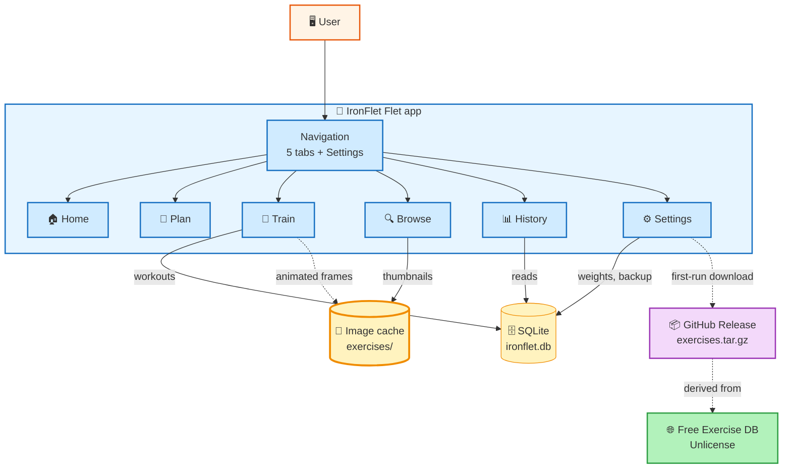

# IronFlet — Bilingual Weight Training Tracker

<div align="center">


**Offline-first fitness tracker with 7 periodized routines, 68 annotated exercises and animated technique images — one Python codebase, three platforms.**

**Tracker de entrenamiento offline con 7 rutinas periodizadas, 68 ejercicios con imágenes animadas e instrucciones paso a paso — un único código Python que corre como APK, escritorio y web.**

---

### Choose Your Language / Elige tu idioma

<p align="center">
  <a href="README.en.md">
    
  </a>
  &nbsp;&nbsp;&nbsp;
  <a href="README.es.md">
    
  </a>
</p>

---

### Architecture Overview



### Quick Start

```bash
# 1. Install deps (uses uv)
uv sync --group dev

# 2. Run as a native desktop window
uv run python main.py

# 3. Or run as a local web server on :8550
IRONFLET_WEB=1 uv run python main.py

# 4. Or build the Android APK
flet build apk --target-platform android-arm64
```

---

**IronFlet** · Flet · Python

&copy; 2026 Alex Nolasco

</div>
